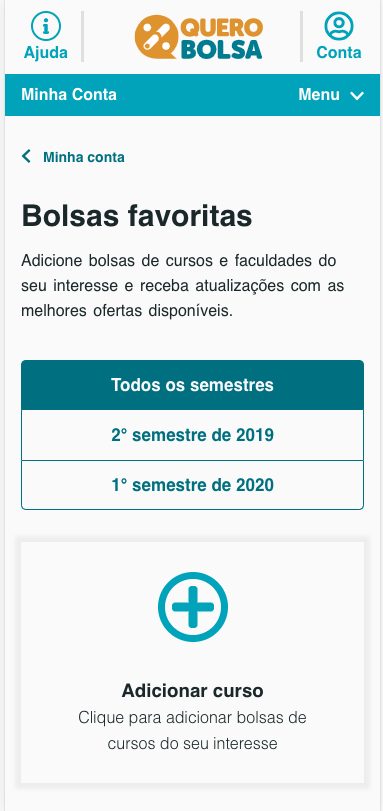

<h1 align="center" style="    max-width: 250px;
    margin: 30px 0;">
    <br>
    Quero Bolsa &nbsp; :mortar_board:
</h1>

[We are ONLINE, try Now](https://quero-bolsa.netlify.app) :tada:<br>
[](https://app.netlify.com/sites/quero-bolsa/deploys)

<h4 align="center">
  A site where you can discover all the best scholarship and choose the better.
</h4>

<p align="center">
  <a href="#rocket-technologies">Technologies</a>&nbsp;&nbsp;&nbsp;|&nbsp;&nbsp;&nbsp;
  <a href="#information_source-how-to-use">How To Use</a>&nbsp;&nbsp;&nbsp;|&nbsp;&nbsp;&nbsp;
  <a href="#sunny-result">Result</a>
</p>


## :rocket: Technologies

This project was developed with the following technologies:

- [ReactJS](https://reactjs.org/)
- [Axios](https://github.com/axios/axios)
- [Polished](https://polished.js.org/)
- [styled-components](https://www.styled-components.com/)
- [React-Icons](https://react-icons.netlify.com/)
- [Prettier](https://prettier.io/)
- [VS Code][vc] with [EditorConfig][vceditconfig] and [ESLint][vceslint]

## :information_source: How To Use

To clone and run this application, you'll need [Git](https://git-scm.com), [Node.js v10.16][nodejs] or higher + [Yarn v1.13][yarn] or higher installed on your computer. From your command line:

```bash
# Clone this repository
$ git clone https://github.com/rodolfomori/quero-bolsa.git

# Go into the repository
$ cd quero-bolsa

# Install dependencies
$ yarn or npm install

# Run the app
$ yarn or npm start
```

## :file_folder: Folder structure

```bash

.

├── public
│   └── index.html
│
├── src >> source code
│   ├── assets
│   ├── components
│   ├── hooks
│   ├── services
│   │   └── api.js
│   │
│   ├── styles
│   │   └── globalStyles.js
│   │   └── theme.js
│   │ 
│   ├── utils
│   ├── App.js
│   ├── index.js
│   └── routes.js
│
│
├── .editorconfig
├── .eslintrc.js
├── .gitignore.js
├── .prettierrc.js
├── README.md
└── package.json


```

## :sunny: Result

  <div style="display: flex;   flex-direction: column;
  align-items: center;">
  <h1 align="center" style="display: flex; flex-direction:row;">
      
        

  </h1>
  <h1 align="center" style="display: flex; flex-direction:row;">
      
      
  </h1>
  </div>

---

Made with ♥ by Rodolfo Mori :wave: [Get in touch!](https://www.linkedin.com/in/rodolfomori/)

[nodejs]: https://nodejs.org/
[yarn]: https://yarnpkg.com/
[vc]: https://code.visualstudio.com/
[vceditconfig]: https://marketplace.visualstudio.com/items?itemName=EditorConfig.EditorConfig
[vceslint]: https://marketplace.visualstudio.com/items?itemName=dbaeumer.vscode-eslint
